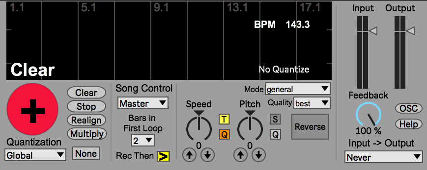

TimestretchLooper
=================

An opensource MaxMsp / M4L looper.

Like Ableton Live's looper, TimestretchLooper does "sound on sound" recording, but also incorporates:

- Independent speed and pitch controls, with the ability to change speed without altering pitch.

- "Multiply" functionality for destructively changing the lengths of clips.

- OSC input and output for controlling and monitoring any parameter of the device.

# Known Bugs

- Windowing improvements needed. Makes pops occasionally with overdub and multiply, not with record, and usually when starting or stoping in the middle of an already present sound.

# Feature Requests

- Undo / Redo Functions -> More buffers.
- Multiple Loops / Looper
- Choice of destructive (Pitch Change) overdub or not
- Quantize overdub choice

# Change Log
10/14/18 (JE) Dusted off the old device and replaced DiracLE with Max's awesome new(ish) groove~ functionality. This upates the device to work with 64-bit and now should work for both Mac and Windows.

01/18/13 (JE) Got things ready to be published online. It's time to let people play with it and make it their own. Please think of contributing to this project if you've got the time and interest :).

10/22/12 (JE) Changed Front Panel, more compact. Fixed slave no quantize on stop bug. Need to replace sync with js. Made formant !/1. Reduced CPU load by putting sound engine inside a poly that is off when cleared. 

09/28/12 (JE) Replaced OSC code with javascript, timestretch_OSC.js. Added "Formant" functionality. Changed song control to "Master/Slave/Free" System.

09/01/12 (JE) Created "Rich Behavior" Midi Map Button. Made Variable Initial buffer Size. Fixed multiply bug (looplength -> max on 
record). Created "positon" variable (every 100ms) and now accepts and Sends OSC postion. 

08/113/12 (JE) Got First Loop Capabilities and Tempo Set going. Replaced "Flattening" mode with just a multiply, more fun this way, even if you have ot pay a bit more attention to what's going on. First actual working version I would say. Still pops on overdub/record every once and a while, and crashes occasionally on multiply. FIxes the problem of overdub on reverse.

07/12/12 (JE) Gave up on keeping exact location when doing destructive overdub for time change. Created "Flattening" mode
which is basically a 1 Loop length multiply.

06/15/12  (JE) Heavily revamped the code for readablity. Preparing for sharing with the community. Added Options for syncing change in tempo/speed, and following tempo. Fixed Multiply. Made all variables and buffers local. Finnally got the thing looking real clean.

4/22/12  (JE) Used "crop" to not need mxj for record and multiply. Created two buffer system. Cleaned up interface. Can use a similar scheme to always record speed changes into "record_buffer"

3/8/12  (JE) Made Record into bufSpeed on pitch change. Still need to make it change to bufPlay when
i. Overdub has turned on
ii. has completed one whole cycle
Starting to get slow moving screen around with all the colored wires, might be a Java drawing problem.

3/5/12  (JE) Made Pitch and Speed look nice. Made Multiply button. Fixed clicking on Record. Overdub has more clicking due to mxj feedback. Seems like I might have to go back to poking just for the overdub section.

3/1/12  (JE) Fixed Overdub sync (%). Tidied up the interface

2/24/12  (JE) Still getting the occasional clicks. Low priority queue for je_Op? Implemented feedback
Multiply enabled. Fixed overdubing for starting halfway and for going in reverse (with je_Op), although, might not need it come to think of it. Just need to do a "multiply" for any overdubs at different speeds. Fixed overdub keep going after clear (endlength started it). Created multiply instead of overdub if speed is changed. Put in speedlimit. Cleaned up a bit. Initialize Dirac speed, works by assigning it at the end of record. Synced Time changes.

2/22/12  (JE) Got Record and Overdub working smoothly

2/20/12  (JE) After much deliberation, decided to go to a multibuffer approach. Compensating Latency sucks. True sample accuracy and with my mxj je_Op external, it seems that buffer commands are pretty straightforward

2/11/12  (JE) Fixed the Waveform, made it colored

2/10/12  (JE) Got Initialization working. Live objects initialize after other objects. Live object model loads last.

1/30/12  (JE) got the sync working and a resizing, still need a realign feature to get it back on track every once in a while. Still has bugs on startup, not initializing proper. BPM Seems wrong on waveform.

